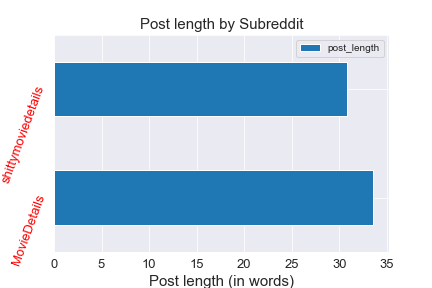

#  Project 3: Classifying  Posts

### Problem statement

We are producing a trivia focused / Jeopardy or Who Wants to Be a Millionaire* style game show, where we want the audience to guess the source of the movie details. Everything is scrambled together! The task: figure out if the details came from good movie details, or whether the movie production team took a shorcut and landed in Sh-tty Movie Details!

*_Trademarks of their appropriate productions_

### Primary techniques

1. Using [Pushshift's](https://github.com/pushshift/api) API, we collect posts from two subreddits.
2. We use NLP to train a classifier on which subreddit a given post came from.
  
---

### Data sources

The following Reddits were scraped:

* [Movie Details](https://www.reddit.com/r/MovieDetails/)
* [💩Sh-tty Movie Details💩](https://www.reddit.com/r/shittymoviedetails/)
* [Movies](https://www.reddit.com/r/movies/)

#### Note on the data and style

Strong language may appear in various Reddit posts in raw form. To the extent possible, it shall be cleaned in the course of the project. There also may be some humor used throughout the presentation of the analysis.

---

### Scraping, pre-processing, cleaning & EDA

* We gather and prepare data using the `requests` library and PushShift API, collecting initally close to 8,000 - 10,000 posts from each subReddit on the following columns:

-- `selftext`

-- `author`

-- `title`

-- `subreddit`

-- `created_utc` (as well as a derived human-readable equivalent, `timestamp`)

-- `is_self`

-- `score`

-- `num_comments`

* We strip the data of any duplicates during the import using `.drop_duplicates`. However, we wind up retaining reposts, in order to avoid running into a data sparsity problem. (On attempt to filter out non-original posts, our data size shrank 20-fold!)
* We merge everything into a single dataframe, using `pd.concat`
* We drop rows where self text is marked as [deleted] or [removed]. This comprises about 1% of our data and is negligible.
* We impute missing text with just spaces
* We further strip the text columns of nonsense content, such as links, and junk, including space breaks that have made their way into the comment fields, as well as emoji and non-Latin alphabet or numeric characters, using `RegEx`.
* _If time: We remove spammy and dominant authors as outliers_

--- 

### Transformations and readiness for modeling

* _If time: We use a combined title-selftext column to equally distribute the weight between posts with and without selftext._
* We use `CountVectorizer` to count up words in our joint datafame
* We run analysis on the length of our posts, author dominance and uniqueness, and distrubution of comment volumes
* We analyze the word count in each subReddit
* We look at bigrams and word frequencies in our subreddit data
* We conduct some sentiment analysis using _____

---

### Modeling

* We model using Random Forest and ___
* Grid search is used to improve parameters and performance, ultimately resulting in ____ being selected for the final model.
* We score the models using ____
  
---

### Key findings and recommendations

_Insert key findings: word count / frequency, sentiment analysis._

* Average post length varies significantly by subreddit:

* Most frequently occurring words in our subreddits, by themselves, are pretty boring:

* But! Most common bigrams start to show more sentiment and personality of our posters:

* Sentiment

---

### Presentation and report

* [`Report: Data pull`](https://git.generalassemb.ly/cotica/project_3/blob/main/code/Project-3-Scraping-Subreddits-data-pull.ipynb)
* [`Report: EDA / modeling`](https://git.generalassemb.ly/cotica/project_3/blob/main/code/Project-3-Scraping-Subreddits-EDA.ipynb)
* [`Slides`](https://docs.google.com/presentation/d/1774txe5GKxSPmvsxLAopb4RNMH6vJHXzSnMIYKXwLMk/edit?usp=sharing)
