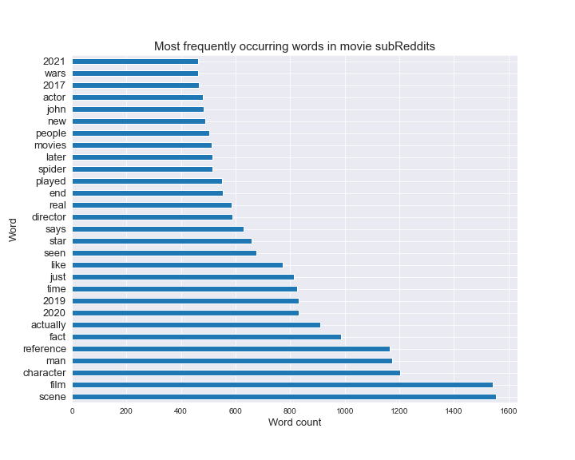

# Classifying  Posts

### Problem statement

We are producing a trivia focused / Jeopardy or Who Wants to Be a Millionaire* style game show, where we want the audience to guess the source of the movie details. Everything is scrambled together! The task: figure out if the details came from good movie details, or whether the movie production team took a shorcut and landed in Sh-tty Movie Details!

*_Trademarks of their appropriate productions_

### Primary techniques

1. Using [Pushshift's](https://github.com/pushshift/api) API, we collect posts from two subreddits.
2. We use NLP to train a classifier on which subreddit a given post came from.
  
---

### Data sources

The following Reddits were scraped:

* [Movie Details](https://www.reddit.com/r/MovieDetails/)
* [💩Sh-tty Movie Details💩](https://www.reddit.com/r/shittymoviedetails/)

* _Gwen Rathgeber provided substantial contributions to development of the idea and code inputs._

#### Note on the data and style

Strong language may appear in various Reddit posts in raw form. To the extent possible, it shall be cleaned in the course of the project. There also may be some humor used throughout the presentation of the analysis.

---

### Scraping, cleaning & EDA

* We gather and prepare data using the `requests` library and PushShift API, collecting initally close to 8,000 - 10,000 posts from each subReddit on the following columns:

-- `selftext`

-- `author`

-- `title`

-- `subreddit`

-- `created_utc` (as well as a derived human-readable equivalent, `timestamp`)

-- `is_self`

-- `score`

-- `num_comments`

* We strip the data of any duplicates during the import using `.drop_duplicates`. However, we wind up retaining reposts, in order to avoid running into a data sparsity problem. (On attempt to filter out non-original posts, our data size shrank 20-fold!)
* We merge everything into a single dataframe, using `pd.concat`
* We drop rows where self text is marked as [deleted] or [removed]. This comprises about 1% of our data and is negligible.
* We impute missing text with just spaces
* We further strip the text columns of nonsense content, such as links, and junk, including space breaks that have made their way into the text fields, as well as emoji and non-Latin alphabet or numeric characters, using `RegEx`.

--- 

### Transformations, preprocessing and NLP

* We use a combined title-selftext column to equally distribute the weight between posts with and without selftext.
* We use `CountVectorizer` to count up words in our joint datafame
* We run analysis on the length of our posts, author dominance and uniqueness, and distrubution of comment volumes
* We analyze the word count of over 100K words across the subreddits.
* We look at bigrams and word frequencies in our subreddit data
* We conduct some sentiment analysis using `VADER`.

---

### Modeling

* We model using Random Forest and Decision Trees, to get a good variety of predictive analysis and interpretability.
* Grid search is used to improve parameters and performance, ultimately resulting in little difference to the scores but helping reduce the overfit.
* We extract feature importances from the random forest model
* We score the models using standard classification metrics, including accuracy
* For the tree, gini scores are revealed and reviewed, using a tree visualizer.
* We pick our tuned random forest as the best model, based on the scores.
  
---

### Key findings and recommendations from the models

* An average author makes 2 subreddit posts 
* Each post has 2 comments on average
* The vast majority -- over 90% -- of all posts are reposts or reshares
* When accounting for upvotes and downvotes, posts in our subreddits score 90 on average. _See:_ [What do Reddit post scores mean?](https://www.reddit.com/wiki/faq#wiki_how_is_a_submission.27s_score_determined.3F)

* Average post length varies insignificantly by subreddit:

* Most frequently occurring words in our subreddits, by themselves, are pretty boring:

* But! Most common bigrams start to show more sentiment and personality of our posters:

In part, there may be less than stellar aha!s here, because we do have some noise words, including "easter egg", "movies", and others, which add no real value to training or separating our data and may likely appear in any movie related subreddit. In retrospect, amending our `stopwords` list to exclude these terms from training may have improved our accuracy by a bit. We see similar results when reviewing our model feature importance, where many noisy words come up merely due to their frequency.

* Sentiment - Interesting, interesting! We may have our first and strongest decypherable signal and indication of separation between our subreddits here. It seems that our Sh-tty Movies, unsurprisingly, contain a bit more negative content or mixed-sentiment content. The amount of positive content is about identical across the subreddits, and most posts are scored as neutral by our sentiment analyzer. (We definitely anticipated the "regular" movie detail subreddit to be mostly neutral, and this is good signal confirmation.)

* Tree visualization

There are 3 fairly interesting (but random sounding) words here, our tree model has picked up on:

* Elf
* Skywalker
* School

All of these belong to the the regular Movie Details class, according to the tree's scoring. The rest of the words are fairly noisy, as with the other tools we have used thus far, and re-enforce the idea that we should have taken out noisy words, including "sh-tty", out of the dataset, because it is a giveway and not only does not help us interpret the model's predictive power, but the noise winds up filling the feature matrix, such that making a distinction on potentially more interesting signals becomes blurry. However, handling stop words is an extremely manual, unscalable process, when we are dealing with a corpus of over 15,000 words, and this analysis is naturally rather retrospective and the insight useful mostly in terms of consideration for future iteration.

Further, as we see with these gini scores, and with the importance weights extracted from our Random Forest model (which are not significantly different that distribution merely by word frequencies, it appears), the predictive power of each individual word overall is very small. Worse, each time we run a different model, the samples chosen as key features appear to be rather random, with earlier models picking up on different words as more predictive, such as "wonder woman". Again, the predictive power of each of these as as signal individually appears rather weak.

### Conclusions

We chose to keep our data composition simple and train primarily on our joint title-post (selftext) text field, as well as the post sentiment score, to predict the target (which, recall, was to determine the subreddit a post is likely to have come from). As we saw, details, such as post length and the number of comments or posts per author were barely distinguishable between the classes.

Ultimately our classes were distributed pretty evenly.

Based on our accuracy score, our tuned Random Forest model was 69% accurate at predicting the right class; which is better than the 50/50 baseline shot, since we did not really have a strong majority class to start out, and this was the best of the models fit, beating the hyper-parameterized and tuned decision tree model's 60% accuracy. We think that the random forest model had decent predictive power, but ultimately, our topics are just too similar for any model to predict very well.

For our game of trivia, fun may be the more important factor than model accuracy, and this is not a model worthy of production.

---

### Presentation and reports

* [`Report: Data pull`](https://git.generalassemb.ly/cotica/project_3/blob/main/code/Project-3-Scraping-Subreddits-data-pull.ipynb)
* [`Report: EDA / modeling`](https://git.generalassemb.ly/cotica/project_3/blob/main/code/Project-3-Scraping-Subreddits-EDA-Modeling.ipynb)
* [`Slides`](https://docs.google.com/presentation/d/1774txe5GKxSPmvsxLAopb4RNMH6vJHXzSnMIYKXwLMk/edit?usp=sharing)
* [`Presentation video`](https://drive.google.com/file/d/1wguvFyjpld7Fv8wK31mQ816ZGOQcMxd0/view?usp=sharing)
